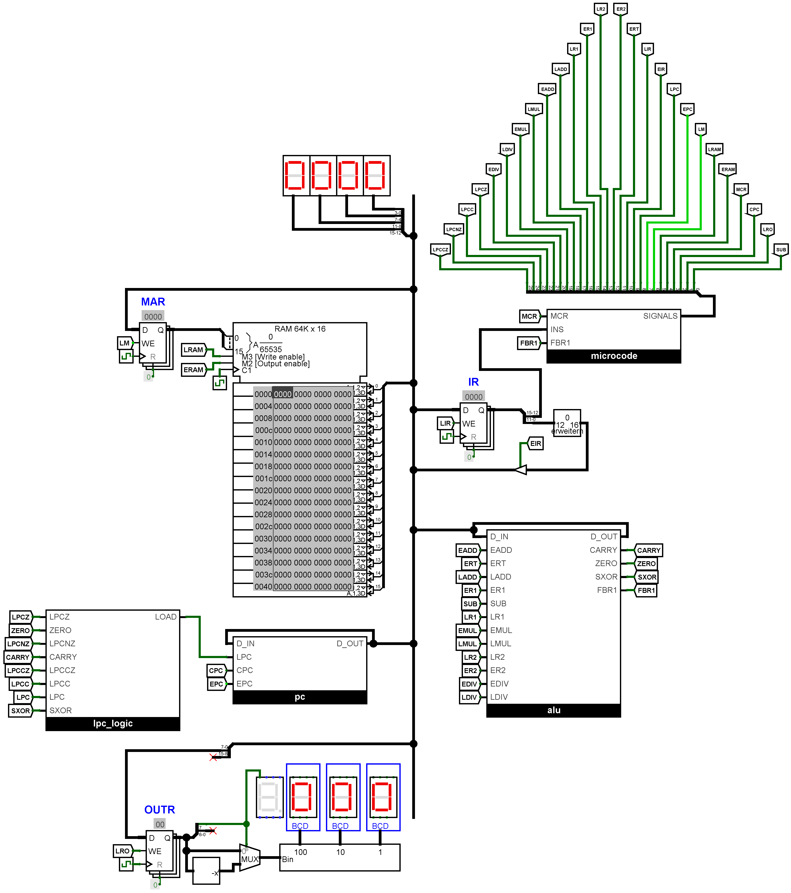

# Logisim CPU
This repository contains the implementation of a 16-bit microcode-controlled CPU I developed. [Logisim-evolution](https://github.com/oskar2517/logisim-assembler) has to be installed to open the project file.

## Features
- 16-bit arithmetic integer operations (addition, subtraction, multiplication, division).
- 32 control lanes driven by a microcode sequencer with support for unconditional and conditional jumps.
- 12-bit memory addresses allow addressing 4096 words (each 16-bit).
- Simple instruction set allows running arbitrary programs (turing-complete).

## Instruction set
Instructions are described in a custom-made high level language which can be compiled to a sequence of microcode operations. The source code for the default instruction set can be found in [microcode.txt](microcode.txt). Before it can be loaded into the sequencer's ROM chip, the source file has to be translated using the aforementioned compiler which can be found [here](https://github.com/oskar2517/microcode-compiler).

Each instruction is 16-bit wide with the four most significant bits being used to store the opcode.


### Instructions
Refer to the [assembler](https://github.com/oskar2517/logisim-assembler) I created to translate programs from assembly to machine code. For writing more complex programs, a custom high level language can be used instead. More information about it can be found [here](https://github.com/oskar2517/logisim-compiler).
| OpCode | Mnemonic | Parameter | Description                                                           |
|--------|----------|-----------|-----------------------------------------------------------------------|
| 0x0    | lda      | \<addr\>  | Loads value at \<addr\> into register A.                              |
| 0x1    | sta      | \<addr\>  | Stores value in register A at \<addr\>.                               |
| 0x2    | ldd      | \<addr\>  | Loads value of address stored at \<addr\> into register A.            |
| 0x3    | stt      | \<addr\>  | Stores value of register A at address stored at \<addr\>.               |
| 0x4    | add      | \<addr\>  | Adds value stored at \<addr\> to value in register A.                 |
| 0x5    | sub      | \<addr\>  | Subtracts value stored at \<addr\> from value in register A.          |
| 0x6    | mul      | \<addr\>  | Multiplies value in register A with value stored at \<addr\>.         |
| 0x7    | div      | \<addr\>  | Divides value in register A by value stored at \<addr\>.              |
| 0x8    | mao      |           | Moves value of register A into output register.                       |
| 0x9    | cmp      | \<addr\>  | Compares value stored at \<addr\> with value in register A.           |
| 0xA    | jmp      | \<addr\>  | Jumps unconditionally to \<addr\>.                                    |
| 0xB    | bre      | \<addr\>  | Jumps to \<addr\> if `cmp` determined equality (A == B).              |
| 0xC    | brn      | \<addr\>  | Jumps to \<addr\> if `cmp` determined inequality (A != B).            |
| 0xD    | brg      | \<addr\>  | Jumps to \<addr\> if `cmp` determined A to be greater than B (A > B). |
| 0xE    | brl      | \<addr\>  | Jumps to \<addr\> if `cmp` deternubed A to be less than B (A < B).    |
| 0xF    | hlt      |           | Halts executon.                                                       |

### Example program
Program that counts in alternation from 0 to 5 and 5 to 0. 
```
// Programs start executing at the top
lda one
mao

inc: // Labels are an abstraction over addresses
    add one
    mao
    cmp five
    brz dec
    jmp inc

dec:
    sub one
    mao
    cmp zero
    brz inc
    jmp dec

zero:
    0

one:
    1

five:
    5
```

## Screenshots


## Related projects
- Microcode compiler: https://github.com/oskar2517/microcode-compiler
- Assembler: https://github.com/oskar2517/logisim-assembler
- High level programming language compiler: https://github.com/oskar2517/logisim-compiler
